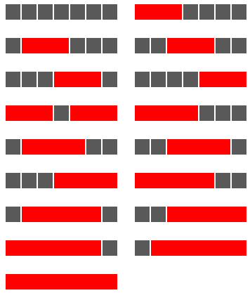

# Projeto 1 --- Pensamento Indutivo

## São Triângulos, Senhor, são Triângulos

O [*Triângulo de Pascal*][pascal] é uma representação matricial dos coeficientes
binomiais, com grande utilidade em teoria das probabilidades, combinatória e
álgebra. O seguinte diagrama apresenta as 8 primeiras linhas do triângulo de
Pascal:

[pascal]: https://en.wikipedia.org/wiki/Pascal%27s_triangle

```verbatim
1
1 1
1 2 1
1 3 3 1
1 4 6 4 1
1 5 10 10 5 1
1 6 15 20 15 6 1
1 7 21 35 35 21 7 1
```

As linhas e colunas do triângulo são numeradas começando ambas em 0
(zero). Assim, para um triângulo com $n$ linhas e $k$ colunas, o número que se
encontra na última linha e última coluna terá índices $n - 1$ e $k - 1$.

Cada elemento do triângulo pode ser construído de forma recursiva, utilizando
apenas informação da linha anterior. Seja $\binom{n}{k}$ o elemento da $n$-ésima
linha, $k$-ésima coluna do triângulo. O valor de tal elemento é dado pela
seguinte equação:

$$
\binom{n}{k}\triangleq\left\{
\begin{array}{ll}
    1 & \text{se}~n = k = 0\\[1em]

    \binom{n - 1}{k - 1} + \binom{n - 1}{k} & \text{se}~0 < n \wedge 0 \leq k \leq n
        \end{array}\right.
$$

### Tarefa

Neste exercício, a sua tarefa é dividida em duas etapas fundamentais:

1. definir uma função recursiva que recebe dois argumentos inteiros, $n$ e
  $k$, e devolve o elemento $\binom{n}{k}$ do triângulo de Pascal;

2. definir uma função que recebe um argumento inteiro indicando, o número de
  linhas do triângulo a construir e o imprime no *standard output*.

Ambas as funções devem ser implementadas em OCaml, com as seguintes assinaturas:

```ocaml
  val n_k_element    : int -> int -> int
  val build_triangle : int -> unit
```

Poderá utilizar as funções auxiliares que achar conveniente.

### Exemplos

#### Triângulo de Pascal de 9 linhas

```verbatim
1
1 1
1 2 1
1 3 3 1
1 4 6 4 1
1 5 10 10 5 1
1 6 15 20 15 6 1
1 7 21 35 35 21 7 1
1 8 28 56 70 56 28 8 1
```

#### Triângulo de Pascal de 10 linhas

```verbatim
1
1 1
1 2 1
1 3 3 1
1 4 6 4 1
1 5 10 10 5 1
1 6 15 20 15 6 1
1 7 21 35 35 21 7 1
1 8 28 56 70 56 28 8 1
1 9 36 84 126 126 84 36 9 1
```

## Querido, a Indução Mudou a Casa

A Ana e o Bernardo vão começar obras de remodelação da cozinha. Uma das ideias
que gostariam de implementar é colocar um friso de azulejos ao longo de toda a
parede. Sendo ambos grandes amantes da decoração de interiores, acordaram nas
seguintes regras de estética:

1. os azulejos do friso só deverão ser de cor vermelha ou preta;
2. cada bloco de azulejos vermelhos deve ter pelo menos 3 unidades consecutivas;
3. dois blocos de azulejos vermelhos (que podem ser de tamanhos diferentes)
  devem estar separados por pelo menos um azulejo preto.

Antes de começarem o trabalho, e conhecendo o comprimento do friso, a Ana e o
Bernardo gostariam de saber quantas formas distintas existem de preencher o
friso, respeitando as regras que estabeleceram.

Tomando como exemplo um friso de tamanho 7, existem as seguintes 17 formas
diferentes de preencher o friso:



### Tarefa

Neste exercício a sua tarefa é definir uma função recursiva, matemática, que
modele este problema. Trata-se, portanto, de uma função que recebe como
argumento o tamanho do friso e devolve o número de formas distintas que existem
de o preencher, de acordo com as regras da Ana e do Bernardo. De seguida, deverá
implementar esta função em OCaml. A função OCaml deverá ter a
seguinte assinatura:

```ocaml
  tiles : int -> int
```

Poderá utilizar as funções auxiliares que achar conveniente.

### Exemplos

1. Um friso de tamanho 8 pode ser preenchido de 27 formas distintas.
2. Um friso de tamanho 10 pode ser preenchido de 72 formas distintas.
3. Um friso de tamanho 15 pode ser preenchido de 798 formas distintas.
4. Um friso de tamanho 20 pode ser preenchido de 8855 formas distintas.
